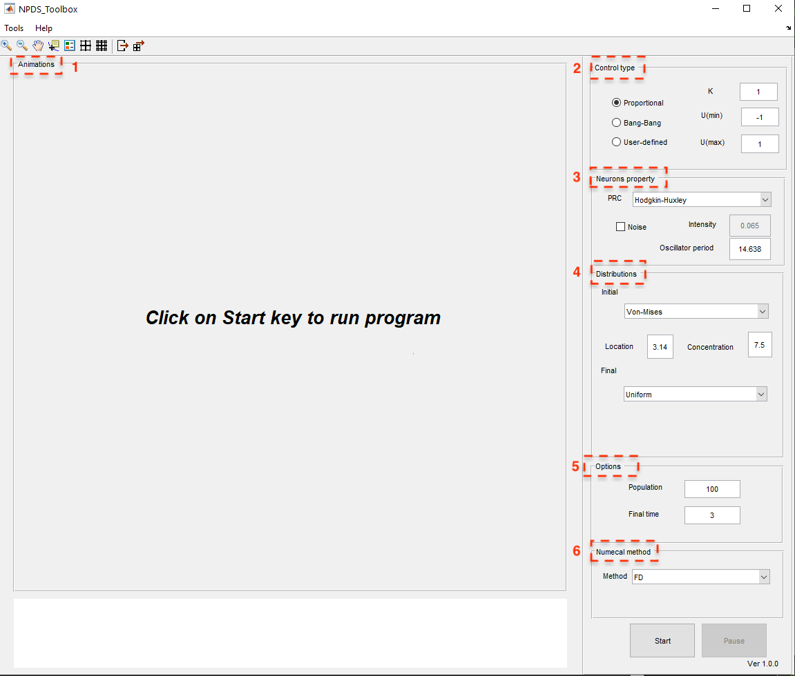

.. _sec-applications:

Applications
------------------------
In NPDS Toolbox we can apply different control strategies to change neural population oscillators synchrony and investigate the dynamics
of some of the common neural models according to the values of their parameters. In this section, we describe different options of the
toolbox for these tasks.

As we mentioned before, this toolbox has two main pages that can be accessed by running the following command in MATLAB.

.. code-block:: matlab

    run NPDSToolbox.m
    
    
Running the above command opens the main page of the package, which is related to the control of synchronous neuronal populations 
(See :numref:`First_page1`).

   
   The main window of NPDS Toolbox

On this page, using :math:`\texttt{Tools}`, you can access another main page of the package called NeuronDynamics, which is related 
to the study of neuron dynamics (see :numref:`Neurondynamics1`).

   
   The graphical user interface showing the dynamics of the included neural models.

We will now describe each of them in detail.

.. _sec-Neural_populations_(de)synchronization:
Neural populations (de)synchronization
~~~~~~~~~~~~~~~~~~~~
The main innovation of the NPDS toolbox is that not only are there some famous and predefined control strategies as proportional 
and bang--bang control laws, but researchers can also define their own control laws and examine their effectiveness in controlling 
the phase distribution.

In this part, users can set the desired control input (the area marked with number 2 in red in Figure :numref:`First_page1`), then, 
choose the type of neural oscillators with their period and determine if they have noise (the area marked with number 3 in red in Figure
:numref:`First_page1`). Afterwards, they should specify the initial and final distributions (number 4 in red in Figure 
:numref:`First_page1`).These distributions can be chosen from predefined ones (Von-Mises or uniform) or defined manually in 
:math:`\texttt{user\_defined\_initial\_dist}` and :math:`\texttt{user\_defined\_final\_dist}` files. Moreover, the number of oscillators
and simulation time can be defined by users (number 5 in red in Figure :numref:`First_page1`). Finally, the numerical approach for the 
simulation should be selected (number 6 in red in Figure :numref:`First_page1`). The details of the proposed numerical methods are 
described in previous sections. At the top of the toolbox home screen, you have access to two :math:`\texttt{Tools}` and 
:math:`\texttt{Help}` options, which you can use to check the dynamics of the neurons and the information about the toolbox, 
respectively. Also below these two options is an advanced toolbar that can be used to configure simulated results. After setting all the
above, you can click the :math:`\texttt{Start}` option at the bottom right of the page to start the simulation and see the results of 
the phase distribution control of the specified neuronal population in the middle panel of the page as an animation in different time 
units and whenever you want youcan hold down the simulation using the :math:`\texttt{Pause}` option at the bottom right of the window.
In the following, the properties of each panel in the window is describe in details.

.. _sec-The_display_panels:
The display panels
^^^^^^^^^^^^^^^^^^^^^^
When the simulation starts, four figures appear in the main window like Fig :numref:`desynch_pro` which show the simulation results over time. In the top left panel the black and red lines show the probability distribution :math:`\rho(\theta,t)` and desired probability distribution :math:`\rho_f(\theta,t)`, respectively. For example, here in this figure, from the right panel, the initial and final distributions are selected :math:`\texttt{Von-Mises}` and :math:`\texttt{uniform}`, respectively (we will discuss this panel in detail later). The top right panel shows the control input :math:`u(t)`, for example :math:`\texttt{Proportional}` is selected here. The bottom left and right panels demonstrate the error (:math:`\int_0^{2\pi}\big(\rho(\theta,t)-\rho_f(\theta,t)\big)^2`) and the phase oscillators, respectively.  Using the Pause button, we can stop the simulation whenever we want and resume it again.

   
   Plots of simulation results over the time.

At the end of the simulation (see Figure :numref:`desynch_bang`), in the bottom panel some information are reported such as the type of phenomenon (desynchronization, synchronization, clustering, etc.), the final error value, the variance of the initial and final distributions, and the initial and final population variances. The obtained results can be saved as figures and matrix forms using the toolbar buttons. In addition, there are other features in the toolbar such as zoom in, zoom out, add legends, etc.

   
   An example of the final results.

.. _sec-Control_inputs:
Control inputs
^^^^^^^^^^^^^^^^^^^^^^
In the Control type panel (top right in Figure :numref:`main1_1`), the control strategy is designed. There is three types of control input: :math:`\texttt{Proportional}` :cite:`Monga2019_1, Moayeri2021`, :math:`\texttt{Bang-Bang}` :cite:`Monga2018_1` and :math:`\texttt{User-defined}`.

In the :math:`\texttt{Proportional}` control law we have:

.. math::
    :label: control_input_pro
    
    U_p(t)=max(min(U(max),-KI(t)),U(min)),
   
where the oscillators should be noise-free. On the other hand we have in noisy oscillators

.. math::
    :label: control_input_pro
    
    U_p(t)=max(min(U(max),-KI(t)-\frac{G(t)}{I(t)}),U(min)),
   
in which

.. math::
    :label: I_formula
    
    I(t)=2\int_0^{2\pi}\Big(\frac{\partial\rho(\theta,t)}{\partial \theta}-\frac{\partial \rho_f(\theta,t)}{\partial \theta}\Big)\mathcal{Z}(\theta)\rho(\theta,t)d\theta,
    
.. math::
    :label: G_formula
    
    G(t)=-\mathcal{B}\int_0^{2\pi}\Big(\frac{\partial\rho(\theta,t)}{\partial \theta}-\frac{\partial \rho_f(\theta,t)}{\partial \theta}\Big)\frac{\partial \rho(\theta,t)}{\partial \theta}d\theta.

where :math:`K`, :math:`U(min)` (lower bound) and :math:`U(max)` (upper bound) are free parameters that are determined by the user (see top right in Figure :numref:`desynch_bang`).

   
   Take a closer look at the :math:`\texttt{control type}` panel options.

In Fourier decomposition method, :math:`I(t)` and :math:`G(t)` are computed as follows:

.. math::
    :label: non35
    
    I(t)=\sum_{k=1}^{N-1}\Big(\big(A_k(t)-\hat{A}_k(t)\big)^2+\big(B_k(t)-\hat{B}_k(t)\big)^2\Big),
    
.. math::
    :label: non36
    
    G(t)=-\frac{\mathcal{B}^2}{2}\sum_{k=1}^{N-1}k^2\Big(A_k(t)\big(A_k(t)-\hat{A}_k(t)\big)+B_k(t)\big(B_k(t)-\hat{B}_k(t)\big)\Big).
    
Actually, we can not choose large values for upper and lower bounds of control input because large electrical pulses may damage tissues in practice. Additionally, large values for $K$ make proportional controllers like bang-bang one. On the other hand, if we choose small values for :math:`K` it just decreases :math:`L^2-`norm initially. Moreover, if the value of upper and lower bounds are small, the controller is not strong enough to change the phase of oscillators. Thus, we need to consider some factors to select appropriate values for controller parameters to have an effective controller. It worth mentioning that :math:`K` cannot be negative and :math:`U(min)` should be less than :math:`U(max)`.

In :math:`\texttt{Bang-Bang}`control law, the value of controller is chosen between two values :math:`U(min)` and :math:`U(max)` according to the sign of :math:`I(t)`:

.. math::
    :label: non37
    
    U_b(t)=\begin{cases} 
    U(min), & I(t)>0, \\
    U(max), & I(t)<0.\end{cases}

Finally, by choosing :math:`\texttt{User-defined}` option, a Matlab file is opened. In this file, the user should define his control law in the body of :math:`\texttt{user\_defined\_control(varagin)}` function according to the appropriate arguments. The arguments of :math:`\texttt{user\_defined\_control}` is depends on the numerical method and the existence of noise. If the numerical approach is a method other than Fourier decomposition, the arguments are the spatial nodes, :math:`\rho(\theta,t)`, :math:`\rho_f(\theta,t)`, :math:`\mathcal{Z}(\theta)`, :math:`\mathcal{Z}'(\theta)`, :math:`\omega`, the number of time steps, and :math:`\Delta t`. If there is noise in the system, the intensity of noise, :math:`\mathcal{B}`, :math:`\frac{\partial\rho(\theta,t)}{\partial\theta}`, and :math:`\frac{\partial\rho_f(\theta,t)}{\partial\theta}` are added to input arguments. But when the numerical approach is Fourier decomposition method, the input arguments are spatial nodes, :math:`\mathcal{Z}(\theta)`, :math:`\mathcal{Z}'(\theta)`, :math:`\omega`, number of time steps, :math:`\Delta t`, :math:`A_k`, :math:`B_k`, :math:`\Tilde{A}_k`, :math:`\Tilde{B}_k`, :math:`\mathcal{I}_k^A(t)` and :math:`\mathcal{I}_k^B(t)`. Moreover, for the noisy systems, :math:`\mathcal{B}`, intensity, and :math:`k` are also considered as inputs. Now, the control law should be defined using any of these input arguments.

For instance, assume we choose the spectral method as our numerical approach for simulation and a continuous control law as :math:`U(t)=SI(t)` where :math:`S` is constant. So, we have:

.. code-block:: matlab

    function u=user_defined_control(varagin)  
    if nargin ==9
        domain=varargin{1};phi=varargin{2};phi_f=varargin{3};
        prc=varargin{4};dprc=varargin{5};error=varargin{6};
        omega=varargin{7};iteration_number=varargin{8};
        dt=varargin{9};
    elseif nargin == 12
        domain=varargin{1};prc=varargin{2};dprc=varargin{3};
        omega=varargin{4};iteration_number=varargin{5};
        dt=varargin{6};
        bk=varargin{7};bfk=varargin{8};ak=varargin{9};  
        afk=varargin{10};Ika=varargin{11};Ikb=varargin{12}; 
    elseif nargin == 13
        domain=varargin{1};phi=varargin{2};phi_f=varargin{3};
        prc=varargin{4};dprc=varargin{5};error=varargin{6};
        omega=varargin{7};iteration_number=varargin{8};
        dt=varargin{9};
        B=varargin{10};dphi=varargin{11};dphi_f=varargin{12};
        intensity=varargin{13};
    elseif nargin == 15
        domain=varargin{1};prc=varargin{2};dprc=varargin{3};
        omega=varargin{4};iteration_number=varargin{5};
        dt=varargin{6};
        B=varargin{7};intensity=varargin{8};bk=varargin{9};
        bfk=varargin{10};ak=varargin{11};afk=varargin{12};
        Ika=varargin{13};Ikb=varargin{14};k=varargin{15}; 
    end
    %User-defined control law
    S=20;
    I=(trapz(domain,(phi-phif).*Zp'.*phi));
    u=S*I;

.. _sec-Phase_response_curve:
Phase response curve (PRC)
^^^^^^^^^^^^^^^^^^^^^^
On the toolbox homepage, in the second right panel from the top, we have the :math:`\texttt{Neurons property}` settings (see Figure :numref:`main1_2`).

In fact, in the neurons property panel, the neural model is chosen from the available models i.e. Hodgkin-Huxley (HH), Fitzhugh-Nagumo (FHN), Rose-Hindmarsh (RH), or Thalamic model. Each model has its own PRC function described in the following table. PRC is experimentally measurable by perturbing an oscillatory neuron at different phases and determining the change in spike timing :cite:`Wilson2014`. Different neural models and populations may lead to different PRC which affects the control model.

=============== ============
Model            PRC
=============== ============
HH               :math:`\texttt{PRC\_interpol(domain,'Hodgkin-Huxley')}`
FHN              :math:`-43.41215711 \sin(\theta)`
RH               :math:`\frac{1-\cos(\theta)}{2\pi}`
Thalamic         :math:`\texttt{PRC\_interpol(domain,'Thalamic')}`
=============== ============

   
   Take a closer look at the :math:`\texttt{Neurons property}` panel options.

Since HH and Thalamic PRCs have not any specific formula, we calculate PRC by interpolation from data. Their data are stored in :math:`\texttt{matrices/Thalamic.mat}` and :math:`\texttt{matrices/Thalamic.mat}` directories.

In addition, in this panel you can specify the period of the oscillators ( :math:`\tau`), the presence or absence of noise. If there exists noise in the system (as Figure :numref:`noisy_example`), the intensity option is available to the user.

   
   An example of noisy neural oscillators.

In fact, if we want to add a Gaussian white noise :math:`\sqrt{2D}\eta(t)` with with zero mean and variance :math:`2D` variance to the model, it is enough to select the :math:`\texttt{noise}` option.

.. _sec-Initial_and_final_distributions:
Initial and final distributions
^^^^^^^^^^^^^^^^^^^^^^
In distribution control, the oscillators move from an initial probability distribution to the desired distribution over time.

In this toolbox (see Figure :numref:`main1_3`), users can utilize predefined :math:`\texttt{Von-Mises}` or :math:`\texttt{uniform}` distribution as initial and final distributions. Also, they can define their desired distributions in :math:`\texttt{user\_defined\_initial\_dist}` and :math:`\texttt{user\_defined\_final\_dist`$ functions for initial and final distributions, respectively.

.. figure:: ./Pictures/Main1_3.png
   :name: main1_3
   :scale: 60 %
   :align: center
   
   Take a closer look at the :math:`\texttt{Distribution}` panel options.
   
In particular, $\texttt{Von-Mises}$ distribution is defined as :cite:`Best1979`:

.. math::
    :label: non38
    
    U\rho(\theta,t)=\frac{\exp(\kappa\cos(\theta+\pi))}{2\pi\mathcal{I}_0(\kappa)},
    
where :math:`\mathcal{I}_0(\kappa)` is the modified Bessel function of first kind of order 0. For such a distribution, the mean is :math:`\theta_0`, and the variance is
:math:`1 -\mathcal{I}_1(\kappa)/\mathcal{I}_0(\kappa)`, in which :math:`\mathcal{I}_1(\kappa)` is the modified Bessel function of
first kind of order 1. :math:`\theta_0` is interpreted as location in toolbox. Moreover the variance decreases as :math:`\kappa` (concentration in toolbox) increases. If we consider :math:`\kappa=0`, the :math:`\texttt{uniform}` distribution is obtained. Figure :numref:`synch` is an example of synchronization where the final distribution is uniform instead of the initial one.

If one choose :math:`\texttt{User-defined$\_$initial}` or :math:`\texttt{User-defined$\_$final}` options, the corresponding Matlab file is opened; then, a new distribution can be defined in it. For example, assume we tend to cluster synchronized neurons. Thus, we choose the initial distribution as :math:`\texttt{uniform}`. For final distribution, we should choose :math:`\texttt{User-defined$\_$final}`. Then, :math:`\texttt{user\_defined\_final\_dist.m}` is created. Our desired final distribution is a bi-modal distribution, which can be realized as a sum of two uni-modal :math:`\texttt{von-Mises}` distributions; so we have :cite:`Monga2019_1`:

.. math::
    :label: non38
    
    \rho_f(\theta,t)=\frac{\exp(\kappa\cos(\theta+\frac{\pi}{2}))+\exp(\kappa\cos(\theta+\frac{3\pi}{2}))}{4\pi\mathcal{I}_0(\kappa)}.
   
It is enough to do the following in the user-defined function:

.. code-block:: matlab

    function [dist,diff_dist]=user_defined_final_dist(domain,omega,i,dt)
    kappa=52;
    dist=(exp(kappa*cos(domain-pi/2-omega*i*dt))...
    +exp(kappa*cos(domain-3*pi/2-omega*i*dt)))...
    /(4*pi*besseli(0,kappa));
    diff_dist=(-kappa*exp(kappa*sin(domain-pi/2-omega*i*dt))...
    -kappa*exp(kappa*sin(domain-3*pi/2-omega*i*dt)))...
    /(4*pi*besseli(0,kappa));

:math:`\texttt{omega*i*dt}` expression in equations is due to the traveling of the wave over time.

.. figure:: ./Pictures/3.png
   :name: synch
   :scale: 60 %
   :align: center
   
   An example of synchronization.
   
.. _sec-Neural_dynamics:
Neural dynamics
~~~~~~~~~~~~~~~~~~~~
There is an option in the toolbox for those who are interested in examining the dynamics of neural models in the toolbox. For this purpose, choose the :math:`\texttt{Neuron Dynamics}` from :math:`\texttt{Tools}` as Figure :numref:`neuron_dynamic_tools` or use short key :math:`\texttt{Crtl+D}`. Moreover, it possible to run this part directly on the MATLAB command lineby :math:`\texttt{run NeuronDynamics.m}` command. By selecting this item a window like Figure :numref:`neuron_dynamic_main` is loaded. As mentioned earlier, by loading this part, the solution of the Hodgkin-Huxley dynamical model is computed automatically with default values.  By adjusting any parameter or type of model, the solution is recomputed.

   
   Select neuron dynamics tool to load that part where the dynamics of the model can be investigated.

   
   The main window of Neuron Dynamic part.
   
In the following, we describe the panels of this part and the details of the existing models. 

.. _sec-The_display_panels:
The display panels
^^^^^^^^^^^^^^^^^^^^^^
There are two main figures in this part. the left panel shows the time plots of the  selected functions. The time plot of membrane potential is demonstrated as a default and you can add the other functions using the checkboxes below the figure. Moreover, the scale mode option scales the functions to the interval :math:`[0,1]` in such a way their details can be seen better. 

The right panel displays the phase portrait of the two or three selected variables. For the three variables phase portrait, you should select the 3D checkbox first; then select the three desired variables. One can hide this figure by clicking on the phase portrait option in the toolbar. Moreover, in the toolbar, there are vector field and stream options that can be added to this figure. Note that one of these two options can be added each time.

At the bottom of these figures, there is a panel that represents some information of the simulation such as the neuron model, indicating whether the system is periodic or not and the CPU time for solving the system.

The right side panel contains the values of parameters of the selected model and slide bars to determine initial conditions and the amount of external current. this panel option is changed depending on the selected model.

The toolbox at the top of the window has other options as well. We can save the results and figures from there easily.  Moreover, there is an option called "Set domain". By clicking on it, the panel on the right side of the window is changed (see Figure :numref:`set_domain`). In this part, you can change the upper and lower bounds of initial conditions for variables, external current, and the duration of the simulation. In the end, we should click on OK to apply changes.

   
   The set domain option where determine the upper and lower bounds of variables, external currents, and the time duration.
   
The remaining sections describe the existing dynamical models in the toolbox and show an example of each.

.. _sec-Hodgkin-Huxley-model:
Hodgkin-Huxley model
^^^^^^^^^^^^^^^^^^^^^^
The Hogkin-Huxley (HH) :cite:`Hodgkin1952` is the pioneer model in computational neuroscience. This model describes the action potential in the squid giant axon by the kinetics of voltage-dependent ion channels i.e. sodium and potassium in the cell membrane.

The properties of an excitable cell are described by the following system of ordinary differential equations:

.. math::
    :label: HH_eq
    
    C\dot{v}=I- \underbrace{g_K n^4(v-v_K)}_{I_{K}}-\underbrace{g_{Na}m^3h(v-v_{Na})}_{I_{Na}}-\underbrace{g_L(v-v_L)}_{I_{L}},\\
    \dot{n}=\frac{n_{\infty}(v)-n}{\tau_n(v)},\\
    \dot{m}=\frac{m_{\infty}(v)-m}{\tau_m(v)},\\
    \dot{h}=\frac{h_{\infty}(v)-h}{\tau_h(v)},
     
for :math:`p=(n,m,h)`, we have:

.. math::
    :label: HH_eq
    
    p_{\infty}=\frac{\alpha_p}{\alpha_p+\beta_p},~~\tau_p=\frac{1}{\alpha_p+\beta_p},
    
where :math:`\alpha_p` and :math:`\beta_p` are called rate coefficient which depend on membrane potential, and we have:

.. math::
    :label: 39
    
    p_{\infty}=\frac{\alpha_p}{\alpha_p+\beta_p},~~\tau_p=\frac{1}{\alpha_p+\beta_p},  \alpha_n(v)=\frac{0.01(10-v)}{\exp\big(\frac{10-v}{10}\big)-1},~~\beta_n(v)=0.125\exp\big(\frac{-v}{80}\big),\\
    \alpha_m(v)=\frac{0.1(25-v)}{\exp\big(\frac{25-v}{10}\big)-1},~~\beta_n(v)=4\exp\big(\frac{-v}{18}\big),\\
    \alpha_h(v)=\exp\big(\frac{-v}{20}\big),~~\beta_h(v)=\frac{1}{\exp\big(\frac{30-v}{10}\big)+1}.
    
where :math:`v(t)` is the electrical potential across the membrane, :math:`m(t)` and :math:`h(t)` are the activation and inactivation variable of sodium channel and :math:`n(t)` is activation variable of potassium channel. Also, :math:`I` is an external current applying to the membrane, :math:`C` is the membrane capacity, :math:`g_K`, :math:`g_{Na}` and :math:`g_L` are maximal conductance of the ion channels. In fact, :math:`g_L` corresponds to the leak channel which is carried mostly :math:`Cl^-` ions. Also, :math:`v_k`, :math:`v_{Na}` and :math:`v_L` are the Nernst equilibrium potentials of the ion channels :cite:`Izhikevich`. 

The results of system :numref:`HH_eq` are obtained by using :math:`\texttt{ode23tb}` Matlab function. Figure :numref:`HH_example` displays an example for HH model with respected parameters and initial condition values.

   
   An Example of an HH dynamical system.
    
.. _sec-Fitzhugh-Nagumo_model:
Fitzhugh-Nagumo model
^^^^^^^^^^^^^^^^^^^^^^
Fitzhugh-Nagumo (FHN) model is a simplified 2D version of the HH model. This model is described as :cite:`Izhikevich,Izhikevich2006`:

.. math::
    :label: 40
    
    \dot{v}=v-\frac{v^3}{3}-w+I,\\
    \dot{w}=a(v+b-cw).
    
In this model :math:`v(t)` mimics the membrane potential and :math:`w(t)` is called the recovery variable showing activation of an outward current. Also, :math:`I` is applied current ,and :math:`a`, :math:`b` and :math:`c` are constants. This system is solved by :math:`\texttt{ode45}` function in Matlab. An example of this dynamical system is represented in Figure :numref:`FHN_example`. It should be noted that in this example the obtained results are in scale mode.

   
   An example of an FHN dynamical system.
   
.. _sec-Rose-Hindmarsh_model:
Rose-Hindmarsh model
^^^^^^^^^^^^^^^^^^^^^^
The Rose-Hindmarsh (RH) model :cite:`Hindmarsh1989` is proposed to study the spike bursting phenomena in the membrane potential of a single neuron. This model is as follows:

.. math::
    :label: 41
    
    \dot{x}=y-ax^3+bx^2-z+I,\\
    \dot{y}=c-dx^2-y,\\
    \dot{z}=r\big(s(x-X_r)-z\big),
    
where :math:`x(t)` is dimensionless variable related to the membrane potential. Also, :math:`y(t)` is called the spiking variable and measures the rate of transportation of sodium and potassium ions. On the other hand, :math:`z(t)` corresponds to adaptation current. :math:`a,~b,~c,~d,~r,~s,~X_r` are model parameters. Also, $I$ is the applied current to the neuron :cite:`Hindmarsh1984`. This nonlinear system is solved by :math:`\texttt{ode15s}` Matlab function. Figure :numref:`RH_example` demonstrates an example of RH dynamical model.

   
   an example of an RH dynamical system.
   
.. _secThalamic neuron_model:
Thalamic neuron model
^^^^^^^^^^^^^^^^^^^^^^
 The neurons in the thalamus can be modeled as :cite:`Rubin2004`:
 
.. math::
    :label: 42
    
    \dot{v}=\frac{1}{C}\bigg(-\underbrace{g_L(v-e_L)}_{I_{L}}-\underbrace{g_{Na}m_{\infty}^3h(v-e_{Na})}_{I_{Na}}-\underbrace{g_K((0.75(1-h))^4)(v-e_K)}_{I_{K}}-\underbrace{g_T p_{\infty}^2(v-e_T)}_{I_{T}}+I\bigg),\\
     \dot{h}=\frac{h_{\infty}-h}{\tau_h},\\
     \dot{r}=\frac{r_{\infty}-r}{\tau_r},
     
where

.. math::
    :label: 43
    
    m_{\infty}=\frac{1}{1+\exp(\frac{-v-37}{7})},~~p_{\infty}=\frac{1}{1+\exp(\frac{-v-60}{6.2})},\\
    h_{\infty}=\frac{1}{1+\exp(\frac{v+41}{4})},\\
    \tau_h=\frac{1}{\alpha_h+\beta_h},\\
    \alpha_h=0.128\exp(\frac{-v-46}{18}),~~\beta_h=\frac{4}{1+\exp(\frac{-v-23}{5})},\\
    r_{\infty}=\frac{1}{1+\exp(\frac{v+84}{4})},\\
    \tau_r=28+\exp(\frac{-v-25}{10.5}).
    
Here :math:`v(t)` is membrane voltage, and :math:`h(t)`, :math:`r(t)` are the gating variables of the neuron describing the modulation of the flow of ions across the neural membrane. Also :math:`g_L`, :math:`e_L`, :math:`g_{Na}`, :math:`e_{Na}`, :math:`g_K`, :math:`e_K`, :math:`g_T`, :math:`e_T` are the parameters of the model. On the other hand, :math:`I_L`, :math:`I_{Na}`, :math:`I_K`, and :math:`I_T` are leak, sodium, potassium and calcium ions channels spiking currents. Moreover, :math:`C` and :math:`I` are the membrane capacitance and injected current, respectively. In order to simulate this dynamical system, we use :math:`\texttt{ode23tb}` Matlab function. An example for this model is provided in Figure :numref:`thalam_example`).

   
   An example of an Thalamic neuron dynamical system.
