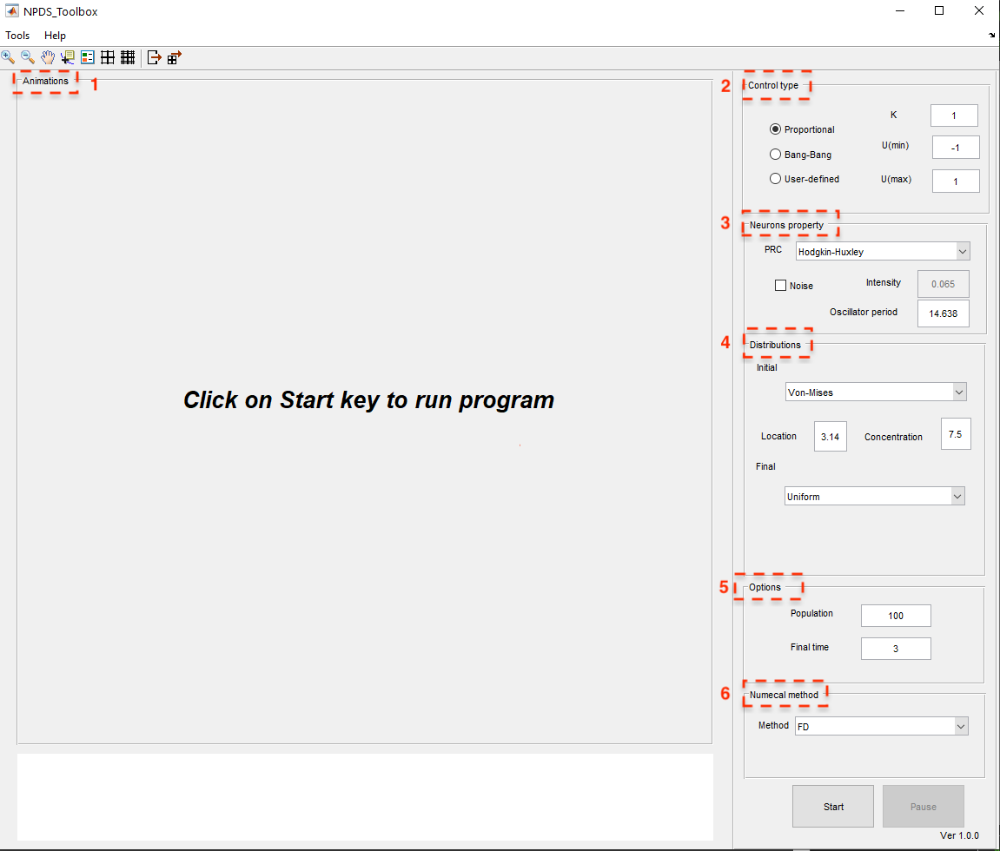

.. _sec-getting-started:
Getting started
------------------------
.. _sec-dependecies:
Dependecies
~~~~~~~~~~~~~~~~~
You  need  only  a  basic  installation  of  Matlab  version  R2016  or  newer  to  run the Toolbox.

.. _sec-installation:

Installation
~~~~~~~~~~~~~~~~~
This toolbox has been tested with MATLAB versions R2016, although we expect it to work with older or newer versions.  Operating systems used during testing were windows 10. To  install  the  MATLAB  toolbox  simply  download  and  unzip  the  GitHub toolbox  into  an  appropriate  location.   Now,  the  main  directories  of  the  toolbox  and  numerical  methods  matrices  should  be  added  to  the  MATLAB  with "addpath" command to install the toolbox.  Note that the toolbox can be uninstalled by simply deleting its directory. So we can run the following in MATLAB:

.. code-block:: matlab

    addpath npdstoolbox2021
    addpath npdstoolbox2021\matrices
    
If you want to load NPDS every time you start MATLAB, type edit startup and append the above line to the end of this file.  

.. _sec-how-to-use-the-GUI:

How to use the GUI
~~~~~~~~~~~~~~~~~
The graphical user interface (see :numref:`main_window`) is loaded by running `NPDSToolbox.m <https://github.com/cmplab/npds-toolbox/master/matlab_code/NPDSToolbox.m>`_ file.  Now, the user can change the options from the panels and start the simulation.  So, run the following Matlab script:

.. code-block:: matlab

   run NPDSToolbox.m
   

   
   The main window of NPDS Toolbox.

.. _sec-the-NPDS-toolbox-panels:

The NPDS Toolbox panels
~~~~~~~~~~~~~~~~~
According to :numref:`main_window`, the main part of NPDS Toolbox consists of two panels. The left panel contains the results of simulation such as probability phase distribution, control input, error and phase of oscillators during the time.  The right panel includes various parts to specify the model, initial and final distributions, control input and numerical method and variables.  Moreover, dynamics of the neuron models included in the toolbox can be investigated in NeuronDynamicstab which is available from the Tools in the upper left part of the first tab.  This part (see :numref:`Neurondynamics`) represents the solution of the dynamical model of the selected neuron model according to the parameters.  When this part isloaded,it computes the solution automatically with default values.  By adjustingany parameter, the solution is recomputed.
 
The panels in each window have their features that are described in detailin their respective sections.
 
 .. _fig-Neurondynamics:
 
 .. figure:: ./Pictures/Neurondynamics.png
   :name: Neurondynamics
   :scale: 60 %
   :align: center
   
   The  graphical  user  interface  showing  the  dynamics  of  the  includedneural models.
