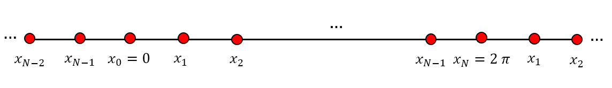

.. _sec-mathematical-background:

Mathematical Background
------------------------
In order to solve the obtained PDEs :eq:`main1` or :eq:`main1_noise` various numerical methods are developed in this toolbox. Users can simulate the models with these methods to evaluate the results.

Actually, first, :eq:`main1` and :eq:`main1_noise` are discretized in time by backward-Euler method and the following equations are obtained :cite:`Moayeri2021`:

.. math::
    :label: time_disc
    
    \frac{\rho(\theta,t_{i})-\rho(\theta,t_{i-1})}{\Delta t}=-\frac{\partial}{\partial\theta}\Big((\omega+ u(t)^T\mathcal{Z}(\theta))\rho(\theta,t_{i})\Big)~~~~i=0, ..., m ,
    
 
 
.. math::
    :label: time_disc_noise
    
    \frac{\rho(\theta,t_{i})-\rho(\theta,t_{i-1})}{\Delta t}=-\frac{\partial}{\partial\theta}\Big((\omega+ u(t)^T\mathcal{Z}(\theta))\rho(\theta,t_{i})\Big)+\mathcal{B}\frac{\partial ^2\rho(\theta,t_{i})}{\partial \theta ^2}~~~~i=0, ..., m,
    

in which, :math:`\Delta t` is the time step size, :math:`t_i=i\Delta t` and :math:`T=m\Delta t`. This scheme preserves the first-order accuracy in time. For ease of explanation, we show :math:`\rho^i=\rho(\theta,t_{i})`. So, :eq:`main1` and :eq:`main1_noise` convert to:

.. math::
    :label: time_disc2
    
    \rho^i+\Delta t\Big(\omega\rho^i_{\theta} +u^{i-1}(\mathcal{Z}(\theta)\rho^i_{\theta}+\frac{d\mathcal{Z}(\theta)}{d\theta}\rho^i)\Big)=\rho^{i-1}.
    
.. math::
    :label: time_disc2_noise
    
    \rho^i+\Delta t\Big(\omega\rho^i_{\theta} +u^{i-1}(\mathcal{Z}(\theta)\rho^i_{\theta}+\frac{d\mathcal{Z}(\theta)}{d\theta}\rho^i)-\mathcal{B}\rho^i_{\theta\theta}\Big)=\rho^{i-1}.
    
 
In the following sections, the proposed numerical methods are examined.

.. _sec-Finite_difference_method:

Finite difference method
~~~~~~~~~~~~~~~~~
The finite difference (FD) method is one of the most famous and classical numerical approaches for solving ordinary/partial differential equations. There exist several kinds of FD algorithms. We utilize the backward difference in temporal dimension and for spatial one, we apply the central and 5-point stencil to discretize PDEs :eq:`main1` and :eq:`main1_noise`, respectively.

Consider the following equations :cite:`Fornberg1988`:

.. math::
    :label: non3
    
     \frac{\partial\rho(\theta,t)}{\partial t}=\frac{\partial\rho(\theta,t_{i+1})-\partial\rho(\theta,t_i)}{\Delta t},~~~i=0,...,M,
     
     
.. math::
    :label: non4
    
      \frac{\partial\rho(\theta,t)}{\partial\theta}=\frac{\rho(\theta_{j+1},t)-\rho(\theta_{j-1},t)}{2\Delta x},~~j=0,...,N,
      
      
where :math:`\Delta t` and :math:`\Delta x` denote the time and space steps. By imposing these formulas in :eq:`main1`, we have:

.. math::
    :label: fd_main_eq
    
      \Big(\frac{-\omega\Delta t-u^{i}\mathcal{Z}(\theta_j)\Delta t}{2\Delta x}\Big)\rho^{i+1}_{j-1}+\Big(1+u^i\mathcal{Z}'(\theta_j)\Big)\rho^{i+1}_j+\Big(\frac{\omega\Delta t+u^{i}\mathcal{Z}(\theta_j)\Delta t}{2\Delta x}\Big)\rho^{i+1}_{j+1}=\rho_j^i,
      
      
in which, :math:`i` and :math:`j` represent time and space nodes, respectively.

The obtained PDEs have periodic boundary conditions; so, the first and last points are the same (See :numref:`periodic_fd`).

   
   Space nodes according to the periodic boundary condition.

If we write :eq:`fd_main_eq` for the first, last, and entire points, at each time step a linear system of algebraic equations is constructed that can be solved easily with a proper solver like QR algorithm.

The derivatives in :eq:`main1_noise` are computed by the following formulas :cite:`Sauer`:

.. math::
    :label: non5
    
     \frac{\partial\rho(\theta,t)}{\partial t}=\frac{\partial\rho(\theta,t_{i+1})-\partial\rho(\theta,t_i)}{\Delta t},~~~i=0,...,M,
     
.. math::
    :label: non6
    
      \frac{\partial\rho(\theta,t)}{\partial\theta}=\frac{\rho(\theta_{j-2},t)-8\rho(\theta_{j-1},t)+8\rho(\theta_{j+1},t)-\rho(\theta_{j+2},t)}{12\Delta x},~~j=0,...,N,
      
.. math::
    :label: non7
    
       \frac{\partial^2\rho(\theta,t)}{\partial\theta^2}=\frac{-\rho(\theta_{j-2},t)+16\rho(\theta_{j-1},t)-30\rho(\theta_{j},t)+16\rho(\theta_{j+1},t)-\rho(\theta_{j+2},t)}{12\Delta x^2},~~j=0,...,N,
       
Now, by using these equations in :eq:`main1_noise`, we have:

.. math::
    :label: non8
    
    \frac{\mathcal{B}\Delta t}{12\Delta x^2}\rho_{j-2}^{i+1}-\Delta t\Big(\frac{\omega+u^i\mathcal{Z}(\theta_j)}{2\Delta x}+\frac{16\mathcal{B}}{12\Delta         x^2}\Big)\rho_{j-1}^{i+1}+\Big(1+\Delta t u^i\mathcal{Z}'(\theta_j)+\frac{30\mathcal{B}\Delta t}{12\Delta x^2}\Big)\rho_{j}^{i+1}\\+\Delta         t\Big(\frac{\omega+u^i\mathcal{Z}(\theta_j)}{2\Delta x}-\frac{16\mathcal{B}}{12\Delta x^2}\Big)\rho_{j+1}^{i+1}+\Big(\frac{\mathcal{B}\Delta t}{12\Delta    x^2}\Big)\rho_{j+2}^{i+1}=\rho^i_j.
      
      
The obtained equations can be re-written in matrix form and solved by QR method.
 
.. _sec-Spectral_method:

Spectral method
~~~~~~~~~~~~~~~~~
High order numerical schemes have been used to simulate and understand the dynamics of biological phenomena such as :cite:`Mohammadi2020,Kumar2020,Parand2019_1`. In fact, spectral methods are one of the most useful tools in numerical simulations due to their exponential convergence and benefits in implementation such as the possibility of parallelization. In the pseudo-spectral collocation method, the solution is approximated by a truncated series of polynomial interpolations based on appropriate nodes. These nodes have a significant effect on the accuracy and convergence; so it is shown that an accurate approximation with exponentially convergence for the smooth problems can be achieved by using Gaussian quadrature collocation points :cite:`Grag2010`.
 
In this toolbox, generalized Lagrange Jacobi Gauss–Lobatto functions (GLJGLFs) are considered as the basis functions. These functions have some benefits in implementation and computing complexity. We apply the generalized Lagrange Jacobi Gauss–Lobatto collocation method on :eq:`time_disc2` and :cite:`time_disc2_noise`.
The standard Jacobi polynomials which is denoted by :math:`J^{(\alpha,\beta)}_n(x)`, :math:`n=0, 1, ...` are one of the most useful orthogonal polynomials on [-1,1]. Besides, these polynomials can be constructed via following recursive formula :cite:`Hadian2019`:

.. math::
    :label: non9
    
     J_0^{(\alpha ,\beta)}(x)=1,~~~~~J_1^{(\alpha ,\beta)}(x)=\frac{\alpha +\beta+2}{2}x+\frac{\alpha -\beta}{2},\\
     J^{(\alpha ,\beta)}_{n+1}(x)=(a^{\alpha,\beta}_{n}x-b^{\alpha,\beta}_{n})J_{n}^{(\alpha ,\beta)}(x)-c^{\alpha,\beta}_{n}J_{n 1}^{(\alpha ,\beta)}(x)~~~n\geq 1

where

.. math::
    :label: non10
    
    a^{\alpha,\beta}_{n}=\frac{(2n+\alpha+\beta+1)(2n+\alpha+\beta+2)}{2(n+1)(n+\alpha+\beta+1)},\\
    b^{\alpha,\beta}_{n}=\frac{(\beta ^2-\alpha ^2)(2n+\alpha+\beta+1)}{2(n+1)(n+\alpha+\beta+1)(2n+\alpha+\beta)},\\
    c^{\alpha,\beta}_{n}=\frac{(n+\alpha)(n+\beta)(2n+\alpha+\beta+2)}{(n+1)(n+\alpha+\beta+1)(2n+\alpha+\beta)}.

The Jacobi polynomial :math:`J_n^{\alpha,\beta}(x)` has exactly n real roots on [-1,1].

Generalized Lagrange Jacobi functions are an extension of classical Lagrange polynomials based on Jacobi Gaussian nodes.

We define GLFs corresponding to the interpolation nodes :math:`x_0<x_1<...<x_n` as follows:

.. math::
    :label: GL1
    
    L_i^{\phi}(x)=\prod_{j=0}^n \frac{\phi(x)-\phi(x_j)}{\phi(x_i)-\phi(x_j)},
    
in which :math:`\phi(x)` is an arbitrary continuous and sufficiently differentiable function depending on the problem features. According to the function :math:`\phi(x)` different basis functions can be defined in the various intervals.

Due to the properties of GLJGLFs, their derivatives can be computed by a direct formula; therefore, there is no need to derive directly from functions, which reduces the computational difficulty and cost dramatically.

We can state two main advantages for this method:

- First, :math:`\phi(x)` is an arbitrary function that can be selected according to the domain and physical properties of the problem. A clever choice increases the effectiveness and accuracy. With different choices of :math:`\phi(x)`, many new basis functions can be generated at different intervals, for instance :cite:`Delkhosh2019`:

  - Classical Lagrange functions: :math:`\phi(x)=x`.
  - Shifted Fractional Lagrange functions on [0,L]: :math:`\phi(x)=2(\frac{x}{L})^{\alpha}-1`.
  - Rational Lagrange functions on :math:`[0,\infty): \phi(x)=\frac{x-L}{x+L}`, where L is a positive real constant.
  - Exponential Lagrange functions on :math:`(-\infty,\infty):\phi(x)=e^x`.
  
- Since derivative matrices can be obtained by direct formulas, there is no need to calculate the derivatives of the functions. Moreover, generalized Lagrange functions have the property of the Kronecker delta; therefore, the proposed method has a small computational cost.

In our problems, we need first and second derivatives matrices and we denote them as :math:`\mathbf{D}^{(1)}` and :math:`\mathbf{D}^{(2)}`, respectively. These matrices are pre-calculated and stored in the matrices folder. For more information on how to calculate them, interesting readers can refer to :cite:`Parand2018_1,Parand2018_2,Latifi2020,Moayeri2020`.

Since in our model :math:`\theta \in [0,2\pi]`, we need to change the domain of Lagrange polynomials; thus, we consider :math:`\phi(x)=\frac{x}{\pi}-1`.

In the pseudo-spectral method, one can approximate function :math:`\rho^i` for time step i in :eq:`time_disc2` and :eq:`time_disc2_noise` as follows :cite:`Moayeri2021`:

.. math::
    :label: approx
    
    \rho^i(\theta)\approx \hat{\rho}^i(\theta)= \sum_{k=0}^n\rho^i(\theta_k)L_k^{\phi}(\theta)=\mathbf{L}^{\phi}(\theta)\mathbf{P}^i
    
where

.. math::
    :label: mat1
    
    \mathbf{L}^{\phi}(\theta)=\begin{bmatrix} L_0^{\phi}(\theta),~L_1^{\phi}(\theta),~ ... ,~ L_n^{\phi}(\theta) \end{bmatrix},\\
    \mathbf{P}^{i}=\begin{bmatrix} \rho^i(\theta_0),~\rho^i(\theta_1),~ ... ,~ \rho^i(\theta_n) \end{bmatrix}^T,
    
The Gauss-Lobatto-Jacobi nodes, :math:`\{\theta_k\}_{k=0}^n`, are chosen as the collocation points to reduce the computations and satisfy the boundary conditions. Now, by using the aforementioned matrices, the problems :eq:`time_disc2` and :eq:`time_disc2_noise` are reduced to linear systems of algebraic equations which can be solved with direct solvers as QR or LU factorization.
 
.. _sec-Radial_basis_function_method:

Radial basis function method
~~~~~~~~~~~~~~~~~
Meshfree methods are another category of methods for solving differential equations. Compared to other numerical methods, meshfree methods have a low computational cost because they do not require a pre-designed mesh in the problem domain :cite:`safdari2018radial,dehghan2019error,assari2019meshless,jafarabadi2018numerical,shivanian2018spectral,shivanian2018improved`. Indeed, in these methods, a set of scattered data represent the domain and boundaries of the problem :cite:`fasshauer2007meshfree`. One of the most popular meshfree methods is the method based on radial basis functions (RBFs) that have made remarkable progress over the last decade. High execution speed, ease of implementation, high accuracy, and flexibility are prominent features of this method :cite:`fasshauer2005rbf,sarra2005adaptive,shcherbakov2016radial,safdari2015radial,sarler2015local,rad2018forward`.

In this toolbox, two meshfree methods have been used to numerically simulate the control model :eq:`time_disc2` and :eq:`time_disc2_noise`. One is the collocation method based on RBFs and the other is the radial basis function generated finite difference method (RBF-FD) which will be explained in the next section. In the RBF collocation method, various radial basis functions can be used, which we have used the Wendland compact support function :cite:`wendland1995piecewise` here:

.. math::
    :label: non11
    
    \phi_i(x)=(1-\delta r_i)^8_+(1+8\delta r_i+25\delta r_i^2+32 \delta r_i^3),
    
    
where :math:`r_i=\|x-x_i\|` is the distance from node :math:`x_i` to :math:`x`, while :math:`\delta` is the size of support for radial function :math:`\phi_i(x)`. In addition, the sign '+' in the function means that :math:`(1-\delta r_i)^8_+` is :math:`(1-\delta r_i)^8` for :math:`\delta r_i \in [0, 1)` and vanished in other regions.

The following definitions are the main features of RBF functions.

:cite:`fasshauer2007meshfree` A function :math:`\phi : \mathbb{R}^s \rightarrow \mathbb{R}` is called radial provided there exists a uni-variate function :math:`\varphi [0, \infty)\rightarrow \mathbb{R}` such that :math:`\phi(\textbf{x})=\varphi(r),~ where=\|\textbf{x}\|` and :math:`\|.\|` is some norm on :math:`\mathbb{R}^s`, usually the Euclidean norm. 

In RBF collocation method, $\rho^i$ for time step i in :eq:`time_disc2` and :eq:`time_disc2_noise` are approximated by linear combination of RBFs  and unknown coefficients as follows:

.. math::
    :label: non12
    
    \rho^i(\theta)\approx \hat{\rho}^i(\theta) = \sum_{k=0}^n a^i_k \phi_k(\theta)=\Phi(\theta)\textbf{A}^i
    
    
where

.. math::
    :label: non12
    
    \textbf{A}^i=[a^i_0, a^i_1, \cdots, a^i_n],
    \Phi(\theta)=[\phi_0(\theta), \phi_1(\theta), \cdots, \phi_n(\theta)].
    
    
Derivatives of :math:`\rho^i` are also easily interpolated by calculating the RBF derivative as follows:

.. math::
    :label: non12
    
    \frac{d\rho^i(\theta)}{d\theta}\approx \frac{d\hat{\rho}^i(\theta)}{d\theta} = \sum_{k=0}^n a^i_k \frac{d\phi_k(\theta)}{d\theta}
    \frac{d^2\rho^i(\theta)}{d\theta^2}\approx \frac{d^2\hat{\rho}^i(\theta)}{d\theta^2} = \sum_{k=0}^n a^i_k \frac{d^2\phi_k(\theta)}{d\theta^2}.
    
In this method, collocation points :math:`\{\theta_k\}_{k=0}^n` can be defined in any way, as long as they cover the domain and boundaries of the equation. Specifically, in this toolbox we consider :math:`n+1` nodes :math:`\theta_0, \theta_1, \cdots, \theta_n` where two points :math:`\theta_0` and :math:`\theta_n` are located on the boundaries to apply the periodic boundary conditions, and we define :math:`\theta_i=(i-1)\Delta\theta, i=1,\cdots,n` where :math:`\Delta\theta=\frac{2\pi}{n-1}`.

Now by placing the approximations of the function :math:`\rho^i(\theta)` and its derivatives in :eq:`time_disc2` and :eq:`time_disc2_noise`, the problem becomes a set of algebraic equations in which the unknown coefficients :math:`\textbf{A}^i` are obtained by solving it. 

.. _sec-Radial_basis_function_generated_finite_difference_method:

Radial basis function generated finite difference method
~~~~~~~~~~~~~~~~~
The RBF-FD method is the second Meshfree method used in this toolbox. This method can be considered as a generalization of the finite difference method :cite:`tolstykh2000using`. The main feature of the RBF-FD method is that it has the sparsity property of the finite-difference method and at the same time its accuracy is close to the RBF method. In RBF-FD, the derivatives of a function are approximated by the linear combination of the RBF functions at the scattered points, its framework operates like a finite difference method, so the term ”FD” is annexed to this method. By inheriting the property of FD, the coefficient matrices obtained are well-conditioned and their bandwidth becomes smaller when the number of stencil nodes decreases :cite:`flyer2016role,fornberg2013stable,bayona2010rbf`. 

Let us consider a set of :math:`n+1` scattered points in domain :math:`\Omega, \Omega^s`, i.e :math:`\textbf{x}=\{x_0, x_1, \cdots, x_n\}`, we define a sub-domain  which is the local domain associated with the point :math:`x_s \in \textbf{x}`. Now consider the set of indexes related to the sub-domain members:
 
.. math::
    :label: non13
    
    \mathcal{I}(x_s)=\mathcal{I}_s=\{j; \|x_j-x_s\|\geq r_s\}.
    
Therefore, the derivative operator :math:`\mathcal{L}` in this method is calculated as follows:

.. math::
    :label: rbffd1
    
    \mathcal{L}u(x_s)\approx \sum_{k\in \mathcal{I}(x_s)}w_i^s u(x_i),
    
where :math:`\{w_i^s\}` are the unknown weights that have to be determined. It should be noted that we need to obtain the unknown vector :math:`\textbf{x}=\{a_i\}_{i\in \mathcal{I}(x)}` such that :math:`\sum_{i\in \mathcal{I}(x)}a_i\phi(\|x-x_i\|_2)` interpolate :math:`u(x)` at each of points in the stencil :math:`\Omega_s`, for this purpose, we use the local distance matrix :math:`\Phi_s` in the form

.. math::
    :label: non14
    
    \textbf{a}=\Phi_s^{-1}\textbf{u}_s,
     
where :math:`\textbf{u}_s` is the data corresponding to stencil of :math:`x_s`. Likewise, the approximation of the operator :math:`\mathcal{L}` is as follows:

.. math::
    :label: rbffd2
    
     \mathcal{L}u(x_s)= \sum_{k\in \mathcal{I}(x_s)}a_i\mathcal{L}\phi(\|x_s-x_i\|_2)=\mathcal{L}_\phi\textbf{a}=\mathcal{L}_\phi\Phi_s^{-1}\textbf{u}_s,
     
in which :math:`\mathcal{L}_\phi` represents an :math:`1\times (n+1)` vector containing elements :math:`\{\phi(\|x_s-x_i\|_2)\}_{i\in \mathcal{I}(x)}` and :math:`\phi` is a RBF centered at :math:`x_s`. In this toolbox, we decide to use the Gaussian RBF :cite:`bayona2012gaussian` with :math:`C^\infty` smoothness degrees as follows:

.. math::
    :label: non15
    
     \phi_i(x)=e^{(-c^2r^2_i)},
     
where :math:`r_i=\|x-x_i\|` is the distance from node :math:`x_i` to :math:`x`, and the shape parameter :math:`c` governs the flatness of the RBFs.

Therefore, based on :eq:`rbffd1` and :eq:`rbffd2`, the following :math:`(n+1)\times(n+1)` linear equation is obtained:

.. math::
    :label: non16
    
    \textbf{w}^s\Phi_s=\mathcal{L}_\phi,
    
where :math:`\textbf{w}^s` is a :math:`1\times (n+1)` local differential weights vector corresponding to stencil :math:`\Omega_S` of :math:`x_S`. Now, the weights of each stencil center :math:`x_s`; where :math:`s\in\{1,\cdots,n+1\}` is obtained by forming a :math:`(n+1)\times(n+1)` linear system and solving it. Also by placing the weights obtained in the :math:`n+1` rows, a sparse differential matrix :math:`\textbf{W}` with n non-zero elements per row is obtained as follows:

.. math::
    :label: non17
    
    \textbf{W}=\begin{pmatrix}
    \textbf{w}^1\\
    \textbf{w}^2\\
    \vdots\\
    \textbf{w}^{(n+1)}
    \end{pmatrix}.
    
Now, using weight matrices :math:`\textbf{W}` and :math:`\textbf{W}^{(2)}`, similar to the finite difference method, the equations :eq:`time_disc2` and :eq:`time_disc2_noise` are transformed into a set of algebraic equations, which can be solved by methods such as LU and QR, and an approximation of the function :math:`\rho^i(\theta)` in a set of nodes :math:`\theta=\{\theta_1,\theta_2,\cdots, \theta_{n+1}\}` at each time steps :math:`i` are obtained.

.. _sec-Fourier_decomposition_method:

Fourier decomposition method
~~~~~~~~~~~~~~~~~
In this approach, the probability distribution and PRC functions are approximate by finite Fourier series :cite:`Monga2019_1`:

.. math::
    :label: rho_fourier
    
    \rho(\theta,t)\approx\frac{1}{2\pi}+\Sigma_{k=1}^{N-1}\Big(A_k\cos(k\theta)+B_k\sin(k\theta)\Big),
  
.. math::
    :label: non18
    
    \rho_f(\theta,t)\approx\frac{1}{2\pi}+\Sigma_{k=1}^{N-1}\Big(\hat{A}_k\cos(k\theta)+\hat{A}_k\sin(k\theta)\Big),
    
.. math::
    :label: non19
    
     \mathcal{Z}(\theta)\approx C_0+\Sigma_{k=1}^{N-1}\Big(C_k\cos(k\theta)+\hat{C}_k\sin(k\theta)\Big).
     
It is worth mentioning that this method guarantees that the phase distribution is :math:`2\pi`-periodic. By multiplying :math:`\cos(k\theta)` and :math:`\sin(k\theta)` on both sides of :eq:`rho_fourier` and integrating from 0 to :math:`2\pi` with respect to :math:`\theta`, we have:

.. math::
    :label: non20
    
     A_k=\pi^{-1}\int_0^{2\pi}\rho(\theta,t)\cos(k\theta)d\theta,
     
.. math::
    :label: non21
    
     B_k=\pi^{-1}\int_0^{2\pi}\rho(\theta,t)\sin(k\theta)d\theta.
     
Now, by taking derivative with respect to time, using integrating by parts and imposing periodic boundary condition according to the models with or without noise, we obtain:

.. math::
    :label: non22
    
     \dot{A}_k=-k\omega B_k-\mathcal{I}_k^A(t)u(t),
     
.. math::
    :label: non23
    
     \dot{B}_k=k\omega A_k+\mathcal{I}_k^B(t)u(t),
     
or

.. math::
    :label: non23
    
     \dot{A}_k=-k\omega B_k-\mathcal{I}_k^A(t)u(t)-\frac{\mathcal{B}^2}{2}k^2A_k(t),
     
.. math::
    :label: non24
    
    \dot{B}_k=k\omega A_k+\mathcal{I}_k^B(t)u(t)-\frac{\mathcal{B}^2}{2}k^2B_k(t),
    
where

.. math::
    :label: non25
    
    \mathcal{I}_k^A(t)=\frac{k}{\pi}\int_0^{2\pi}\mathcal{Z}(\theta)\rho(\theta,t)\sin(k\theta)d\theta,
    \mathcal{I}_k^B(t)=\frac{k}{\pi}\int_0^{2\pi}\mathcal{Z}(\theta)\rho(\theta,t)\cos(k\theta)d\theta.
    
Similarly, we have:

.. math::
    :label: non26
    
    \dot{\hat{A}}_k=-k\omega\hat{B}_k,
   
.. math::
    :label: non27
    
    \dot{\hat{B}}_k=k\omega \hat{A}_k.
    
In order to approximate the functions, we should use a suitable iterative method like the Runge-Kutta algorithm to obtain the Fourier coefficients.

.. _sec-Runge-Kutta_algorithm:

Runge-Kutta algorithm
~~~~~~~~~~~~~~~~~
At each time step in the simulation, we need to calculate the phase of the oscillators by solving :eq:`osci` or :eq:`osci_noise`. In this toolbox, we utilize the well-known Runge-Kutta approach which is a good choice for solving ODEs. In the following, we describe this algorithm.

Fourth-order Runge-Kutta algorithm for ODEs
^^^^^^^^^^^^^^^^^^^^^^
In order to find the phase of noise free oscillators, we solve :eq:`osci`. First, we define:

.. math::
    :label: non28
    
    f(\theta)=\omega +u\mathcal{Z}(\theta),
    
then, :eq:`osci` is discretized to the following equation (where :math:`k = 0,··· ,r`, and :math:`r` is the number of Runge–Kutta steps, and :math:`h=\frac{\Delta t}{r}`):

.. math::
    :label: non29
    
    \hat{\theta}^{k+1}_j=\hat{\theta}^{k}_j+\frac{h}{6}\bigg(\mathcal{K}_1+2\mathcal{K}_2+2\mathcal{K}_3+\mathcal{K}_4\bigg),
    
where

.. math::
    :label: non30
    
    \mathcal{K}_1=f(\hat{\theta}^{k}_j),~\sigma_1 =\hat{\theta}^{k}_j+0.5h\mathcal{K}_1,\\
    \mathcal{K}_2=f(\sigma_1),~\sigma_2 =\hat{\theta}^{k}_j+0.5h\mathcal{K}_2,\\
    \mathcal{K}_3=f(\sigma_2),~\sigma_3 =\hat{\theta}^{k}_j+h\mathcal{K}_3,\\
    \mathcal{K}_4=f(\sigma_3).
    
where the first and last steps are :math:`\hat{\theta}^0_j=\theta_j^i` and :math:`\theta_j^{i+1}=\hat{\theta}^{r}_j`.

Fourth-order Runge-Kutta algorithm for stochastic ODEs
^^^^^^^^^^^^^^^^^^^^^^
As we know, :eq:`osci_noise` should be solved to find the phase of noisy oscillators at each step. We utilize the well-known fourth-order Runge-Kutta approach to solve this stochastic ODE. We have:

.. math::
    :label: stoc_ODE
    
    d\theta_j^i=\delta dt+\mathcal{Z}(\theta)\bigg[u^{i-1}+\sqrt{2D}dW_j(t)\bigg],~~~j=1, \cdots, M,
    
in which :math:`W_j(t)` is the standard Weiner process. We define functions :math:`f` and :math:`g` from :eq:`stoc_ODE`:

.. math::
    :label: non31
    
    f(\theta)=\omega +u\mathcal{Z}(\theta),
    
.. math::
    :label: non32
    
    g(\theta)=\sqrt{2D}+\mathcal{Z}(\theta).
    
The main problem is discretized as follows (:math:`k=0, \cdots, r`, where :math:`r` is the number of Runge-Kutta steps and :math:`h=\frac{\Delta t}{r}`).

.. math::
    :label: non33
    
    \hat{\theta}^{k+1}_j=\hat{\theta}^{k}_j+\frac{1}{6}\bigg(h(\mathcal{K}_1+2\mathcal{K}_2+2\mathcal{K}_3+\mathcal{K}_4)+W_j(\mathcal{S}_1+2\mathcal{S}_2+2\mathcal{S}_3+\mathcal{S}_4)\bigg),
    
where

.. math::
    :label: non34
    
    \mathcal{K}_1=f(\hat{\theta}^{k}_j),~\mathcal{S}_1=g(\hat{\theta}^{k}_j),\\
    \sigma_1 =\hat{\theta}^{k}_j+0.5h\mathcal{K}_1+0.5W_j\mathcal{S}_1,\\
    \mathcal{K}_2=f(\sigma_1),~\mathcal{S}_2=g(\sigma_1),\\
    \sigma_2 =\hat{\theta}^{k}_j+0.5h\mathcal{K}_2+0.5W_j\mathcal{S}_2,\\
    \mathcal{K}_3=f(\sigma_2),~\mathcal{S}_3=g(\sigma_2),\\
    \sigma_3 =\hat{\theta}^{k}_j+h\mathcal{K}_3+W_j\mathcal{S}_3,\\
    \mathcal{K}_4=f(\sigma_3),~\mathcal{S}_4=g(\sigma_3).
    
Note that :math:`\hat{\theta}^0_j=\theta_j^i` and :math:`\theta_j^{i+1}=\hat{\theta}^{r}_j`.
